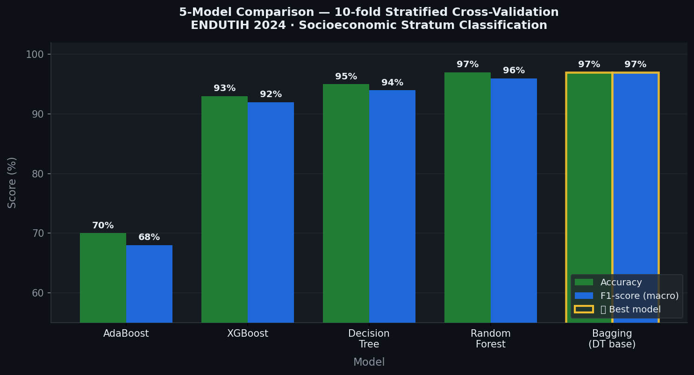

# 🏠 Socioeconomic Classification via ICT Usage Patterns
### Predicción de Estrato Socioeconómico mediante Machine Learning

[](https://python.org)
[](https://scikit-learn.org)
[](https://xgboost.readthedocs.io)
[](https://jupyter.org)
[-4A90D9?style=for-the-badge)](https://www.inegi.org.mx/programas/endutih/2024/)
[](https://colab.research.google.com/github/JuanDiego076/socioeconomic-classification-via-ict/blob/main/socioeconomic_classification_ict.ipynb)

---

## 🎯 Problem Statement

A household's access to ICT services — internet connectivity, TV subscriptions, number of smartphones, type of connection — is a strong proxy for its socioeconomic standing. This project asks: **can we predict a household's socioeconomic stratum purely from its technology profile?**

The answer has direct applications in public policy (subsidy targeting, digital inclusion programs) and commercial strategy (market segmentation, telecom product design).

**Dataset:** ENDUTIH 2024 (INEGI) — Mexico's national household survey on ICT availability and usage.  
**Scale:** 58,080 households · ~100 ICT variables · multiclass target: `ESTRATO` (socioeconomic stratum)

---

## 📊 Results — 5-Model Comparison

All models evaluated with **10-fold Stratified Cross-Validation** on 80% training data, final metrics on a held-out 20% test set.



| Model | Accuracy | F1-score (macro) | Notes |
|---|---|---|---|
| **Bagging (DT base)** | **97%** | **97%** | 🏆 Best overall — robust to noise |
| **Random Forest** | **97%** | **96%** | 🥈 Near-identical with hyperparameter tuning |
| Decision Tree | 95% | 94% | Strong single-model baseline |
| XGBoost | 93% | 92% | Competitive; sensitive to feature scale |
| AdaBoost | 70% | 68% | Most affected by class imbalance & nulls |

**Key finding:** Ensemble methods based on decision trees dramatically outperform boosting approaches on this tabular dataset with mixed variable types and missing values — consistent with the broader RF vs. boosting literature on heterogeneous tabular data.

---

## 🏛️ Architecture — Sklearn Pipeline

```
┌─────────────────────────────────────────────────────────────────────┐
│                     PREPROCESSING PIPELINE                          │
│                                                                     │
│  Raw Features (ENDUTIH 2024)                                        │
│  58,080 households × ~100 ICT variables                             │
│         │                                                           │
│         ▼                                                           │
│  ┌─────────────────────┐    ┌──────────────────────────────────┐   │
│  │   NUMERIC BRANCH    │    │      CATEGORICAL BRANCH          │   │
│  │                     │    │                                  │   │
│  │  SimpleImputer      │    │  SimpleImputer                   │   │
│  │  (median)           │    │  (most_frequent)                 │   │
│  │       ↓             │    │       ↓                          │   │
│  │  StandardScaler     │    │  OneHotEncoder                   │   │
│  │                     │    │  (handle_unknown='ignore')       │   │
│  └────────┬────────────┘    └───────────────┬──────────────────┘   │
│           └──────────────┬──────────────────┘                      │
│                          ▼                                          │
│                   ColumnTransformer                                 │
│                          ▼                                          │
│              ┌───────────────────────┐                             │
│              │      CLASSIFIER       │                             │
│              │  (5 models compared)  │                             │
│              └───────────────────────┘                             │
│                          ▼                                          │
│              ESTRATO prediction (4 strata)                          │
└─────────────────────────────────────────────────────────────────────┘
```

**Validation:** `StratifiedKFold(n_splits=10)` — preserves class distribution across folds.  
**Tuning:** `RandomizedSearchCV(n_iter=30)` on Random Forest + XGBoost independently.  
**Serialization:** Best model saved via `joblib` for reproducible inference.

---

## 📁 Project Structure

```
socioeconomic-classification-via-ict/
├── socioeconomic_classification_ict.ipynb   # 📓 Full pipeline: EDA → modeling → evaluation
├── tr_endutih_hogares_anual_2024.csv        # 📦 Source dataset (INEGI ENDUTIH 2024, public)
├── docs/
│   └── model_comparison.png                # 📊 5-model results chart
├── requirements.txt
├── .gitignore
└── README.md
```

---

## ⚙️ Setup & Execution

**Requirements:** Python 3.10+

```bash
# 1. Clone the repository
git clone https://github.com/JuanDiego076/socioeconomic-classification-via-ict.git
cd socioeconomic-classification-via-ict

# 2. Install dependencies
pip install -r requirements.txt

# 3. Open the notebook
jupyter notebook socioeconomic_classification_ict.ipynb
```

> **Google Colab:** Click the "Open in Colab" badge above, then mount your Drive and update the `file_path` variable to point to the dataset.

---

## 🔑 Key Technical Decisions

**ColumnTransformer Pipeline over a single encoder:** ENDUTIH variables mix truly numeric values (device counts, quantity of connections) with binary/coded categoricals (service presence 1/2, connection type codes). A single encoding strategy distorts one or the other. The `ColumnTransformer` applies `StandardScaler` to numeric columns and `OneHotEncoder` to categoricals — all within a single `sklearn.Pipeline`, guaranteeing no data leakage across CV folds.

**Heuristic for categorical detection:** Variables with ≤10 unique numeric values are reclassified as categorical before the pipeline. This captures the pervasive binary (1/2) and ordinal (1/2/3) columns typical of INEGI survey microdata without manual labeling.

**Null handling strategy:** Columns with >70% missing values are dropped pre-pipeline. Remaining nulls are handled inside the pipeline (median imputation for numerics, mode for categoricals) — imputation statistics learned exclusively from training data each fold.

**Why Bagging wins over XGBoost:** Bagging's parallel variance reduction handles sparse post-OHE features and moderate null rates more robustly than AdaBoost/XGBoost's sequential correction. XGBoost's advantage on dense, well-scaled tabular data is neutralized here by the heterogeneous feature space.

---

## 📝 Lessons Learned

- AdaBoost's ~70% result confirmed that sequential boosting is fragile under class imbalance + noisy survey variables. Identifying this failure mode early focused effort on the Bagging/RF branch.
- `StratifiedKFold` is non-negotiable for socioeconomic survey data — ESTRATO distributions in INEGI microdata are far from uniform, and standard KFold would produce biased fold compositions.
- `RandomizedSearchCV(n_iter=30)` vs. `GridSearchCV` covers the search space in ~1/10th the compute time — adequate for exploratory hyperparameter selection at this scale.

---

## 📦 Dataset

**Source:** [ENDUTIH 2024 — INEGI](https://www.inegi.org.mx/programas/endutih/2024/)  
**Scope:** National survey on ICT availability and usage in Mexican households (2024 annual edition)  
**License:** Public domain — INEGI open data policy  
**Shape:** 58,080 households × ~100 variables

---

## 👤 Author

**Juan Diego Taborda Roldán**  
Telecommunications Engineer · Data Engineer & Data Scientist  
[LinkedIn](https://www.linkedin.com/in/juandiegotabordaroldan) · [GitHub](https://github.com/JuanDiego076) · [juandiego276@gmail.com](mailto:juandiego276@gmail.com)
